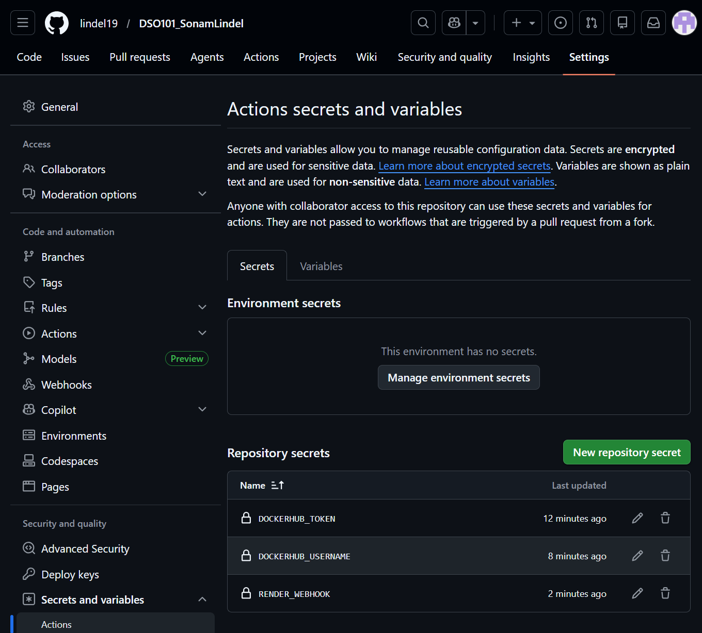
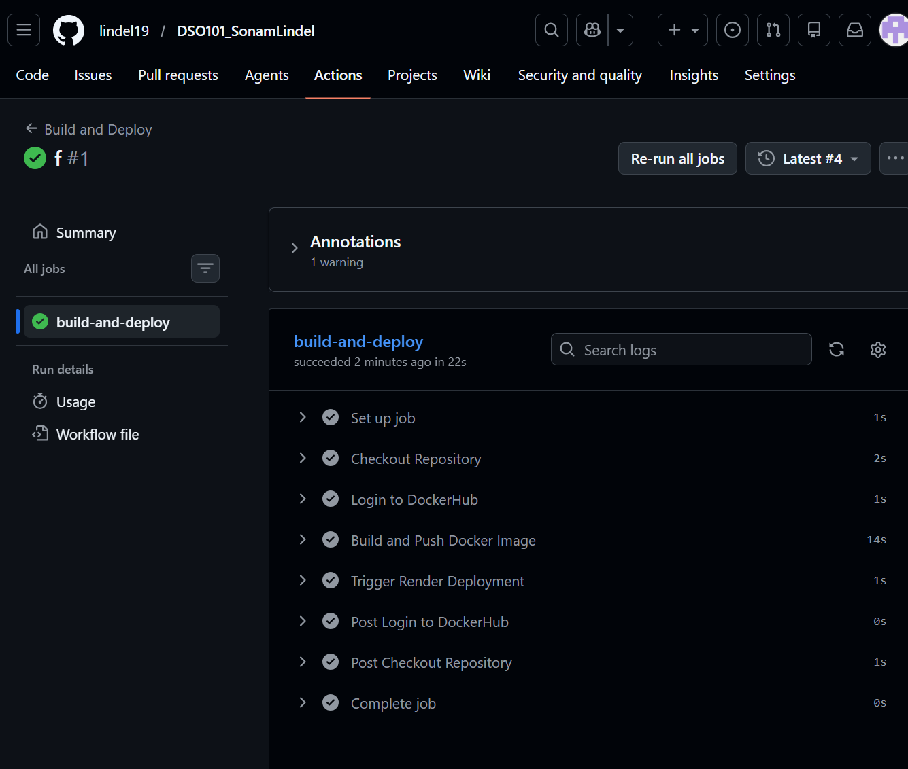
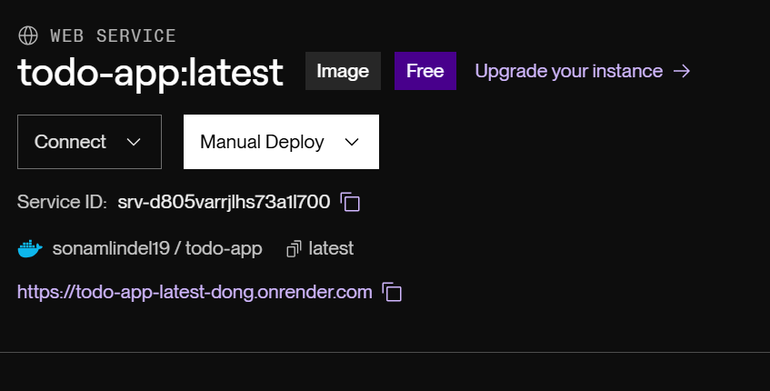

# DSO101 Assignment III  
## Continuous Integration and Continuous Deployment

### Student Name
Sonam Lindel

### Student Number
02250369

---

# Introduction

For this assignment, I configured a GitHub Actions workflow to automate the Continuous Integration and Continuous Deployment (CI/CD) pipeline for my To-Do List application. The automation handles building a Docker container for the application, pushing the container to DockerHub, and deploying it live on Render.com. 

The main objective of this assignment was to transition from manual deployments to automated workflows, understanding how modern CI/CD practices improve deployment speed, reliability, and security.

---

# Project Overview

The project focuses on creating an automated pipeline using the backend API (Node.js + Express.js) developed in previous assignments. 

The CI/CD pipeline consists of the following automated stages triggered upon every push to the `main` branch:
- Source Control: Code is pushed to GitHub.
- Build: GitHub Actions checks out the code and builds a Docker image.
- Push: The Docker image is securely authenticated and pushed to a public Docker Hub repository.
- Deploy: A webhook triggers Render.com to pull the latest image and deploy it to the cloud.

---

# Technologies Used

The following tools and technologies were utilized to achieve the CI/CD automation:

## Application Stack
- Node.js
- Express.js
- Jest (Testing framework)

## DevOps & Deployment Tools
- GitHub
- GitHub Actions
- Docker
- Docker Hub
- Render.com

---

# Step 1: Repository and Application Verification

Before setting up automation, the application code had to be verified. 
- Ensured the `package.json` file contained the necessary `"start"` and `"test"` scripts to run the server and Jest tests.
- Ensured the GitHub repository was set to public.

---

# Step 2: Verifying the Dockerfile

A `Dockerfile` was created in the backend repository using the Node.js LTS alpine image. 

The Dockerfile was configured to:
- Set the working directory to `/app`.
- Copy dependency files and run `npm install`.
- Copy all application files over.
- Run `npm test` to ensure the build fails if tests do not pass.
- Expose port `3000` and run `npm start`.

---

# Step 3: Creating the GitHub Actions Workflow

To automate the build and deployment, a GitHub Actions configuration file was created.
- Created the file path `.github/workflows/deploy.yml` at the root of the repository.
- Configured the workflow to trigger `on: push` to the `main` branch.

The YAML file handles checking out the repository, logging into Docker Hub, building the Docker image, pushing it with the `latest` tag, and sending a webhook to Render.

---

# Step 4: Securing Credentials with GitHub Secrets

To ensure sensitive credentials were not exposed, they were completely kept out of the source code. 

Instead, GitHub Secrets were configured in the repository settings:
- `DOCKERHUB_USERNAME`: My Docker ID.
- `DOCKERHUB_TOKEN`: A Personal Access Token generated from Docker Hub for secure authentication.
- `RENDER_WEBHOOK`: The deploy hook URL provided by Render.com.

The `deploy.yml` file referenced these using the `${{ secrets.SECRET_NAME }}` syntax.

---

# Step 5: Render.com Configuration

To host the application, a new Web Service was created on Render.com.
- Selected "Deploy an existing image from a registry".
- Pointed the service to the public Docker Hub repository.
- Copied the "Deploy Hook" URL from Render's settings and added it as a GitHub Secret so GitHub Actions could automatically trigger redeployments.

---

# Problems Faced During the Assignment

Several issues were encountered while establishing the CI/CD pipeline. 

Some of the main challenges included:
- Nested GitHub Folder: Initially, GitHub Actions did not recognize the workflow because the `.github` folder was nested inside a subfolder instead of the repository root.
- Incorrect Build Paths: The `docker build` command in the YAML file failed because the path to the Dockerfile was incorrect. This was fixed by updating the path to accurately reflect my repository's structure (`./todo-app/backend`).
- Docker Hub Authentication Errors: Encountered an `unauthorized: incorrect username or password` error. This was resolved by generating a fresh Personal Access Token (PAT) on Docker Hub and ensuring my actual Docker ID (not my email) was used in GitHub Secrets.
- Webhook Exit Code 2 Error: The final deployment step failed with `curl exit code 2` because the `RENDER_WEBHOOK` secret was initially missing/empty. Once the web service was created on Render and the deploy hook URL was added to GitHub Secrets, the pipeline succeeded.

---

# What I Learned

This assignment gave me hands-on experience with modern DevOps practices. 

I learned:
- How to structure and write YAML syntax for GitHub Actions workflows.
- The importance of placing the `.github/workflows` directory at the absolute root of a repository.
- How to securely manage and inject sensitive credentials into code using GitHub Secrets without hardcoding them.
- How to automate Docker builds and pushes directly from source control.
- How webhooks function to trigger events between different platforms (GitHub to Render).
- How to read CI/CD logs to troubleshoot and fix pipeline failures.

---

# Deployment Links & Deliverables

## GitHub Repository
[Insert Link to your GitHub Repo here]

## Live Render Deployment
[Insert Link to your Render App here]

## Docker Hub Image
[Insert Link to your Docker Hub Repo here]

## Screenshots

**Successful GitHub Actions Workflow:**

**Docker Hub Pushed Image:**

**Live Render.com Deployment:**
