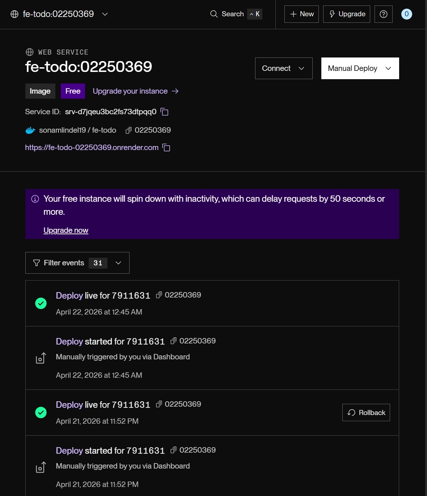
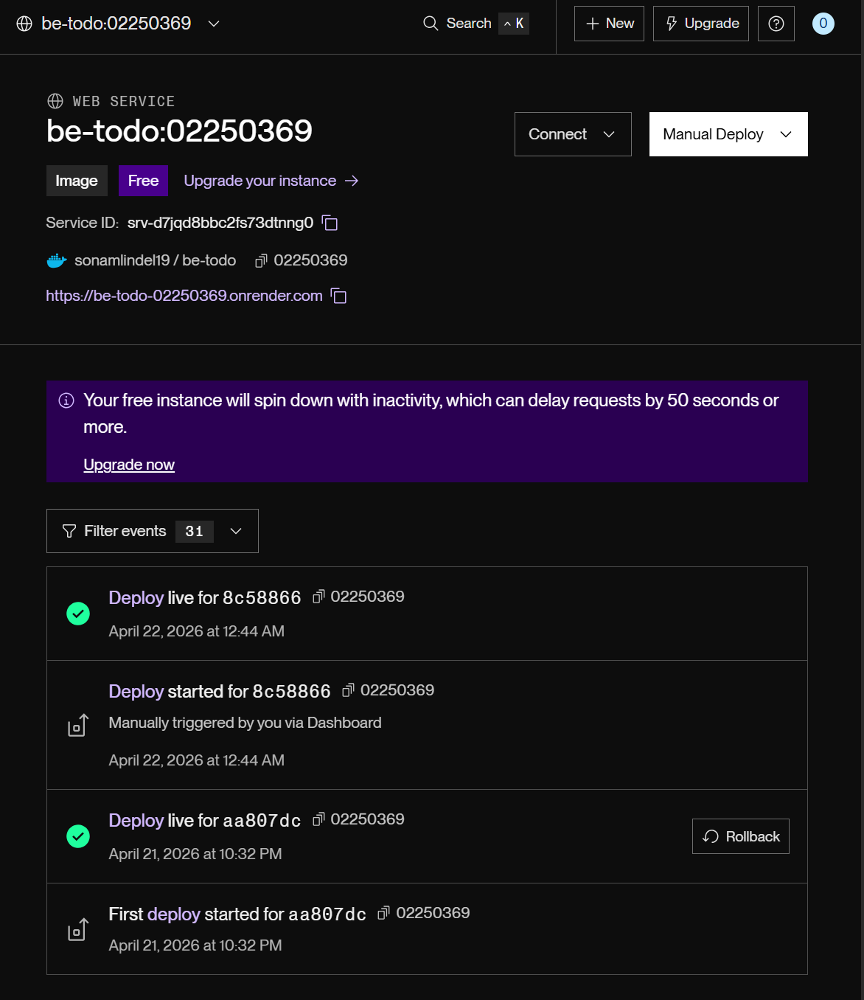
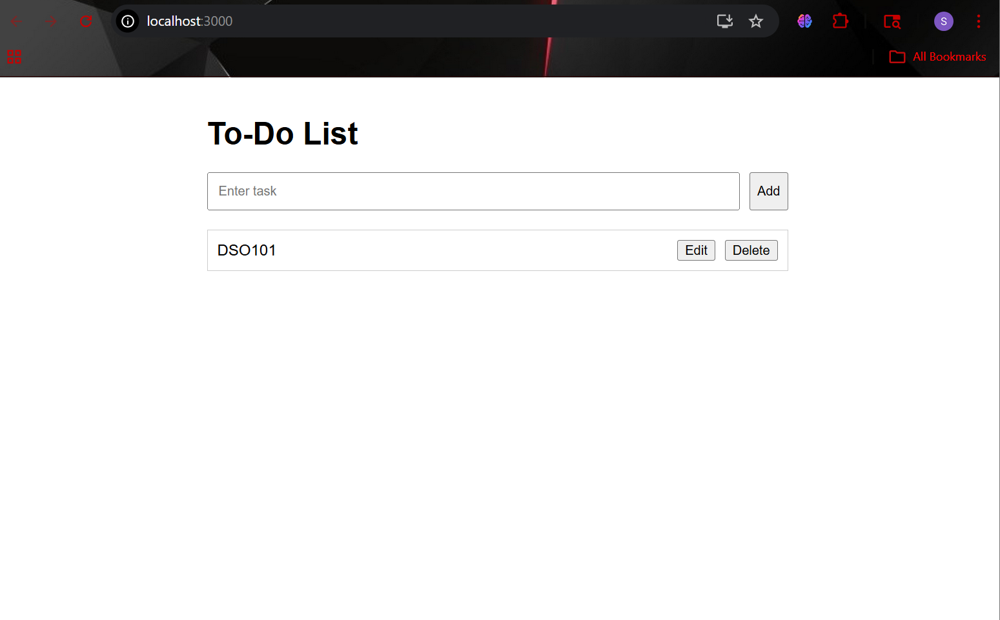
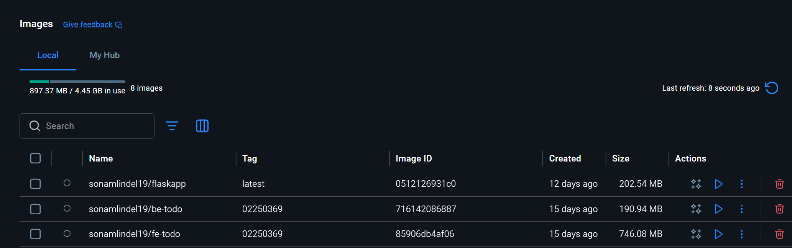

# DSO101 Assignment 1  
## Continuous Integration and Continuous Deployment (CI/CD)

### Student Name
Sonam Lindel

### Student Number
02250369

---

# Introduction

For this assignment, I developed a full-stack To-Do List web application and deployed it using Docker and Render.com. The application allows users to add, edit, delete, and store tasks permanently using PostgreSQL.

The main objective of the assignment was to understand how modern applications are built, containerized, and deployed using DevOps tools and practices.

---

# Project Overview

The application consists of three main components:

- Frontend (React.js)
- Backend API (Node.js + Express.js)
- PostgreSQL Database

The frontend communicates with the backend API, while the backend handles all CRUD operations and stores data in PostgreSQL.

---

# Technologies Used

## Frontend
- React.js
- Axios

## Backend
- Node.js
- Express.js

## Database
- PostgreSQL

## Deployment Tools
- Docker
- Docker Hub
- Render.com

---

# Step 1: Creating the To-Do List Application

The first step was creating a simple To-Do List application with the following features:

- Add tasks
- Edit tasks
- Delete tasks
- Mark tasks as completed
- Store tasks permanently in a database

The project was divided into two separate folders:
- frontend
- backend

---

# Step 2: Backend Development

The backend was developed using Express.js.

The following API routes were implemented:

| Method | Route | Purpose |
|---|---|---|
| GET | /tasks | Fetch all tasks |
| POST | /tasks | Add a new task |
| PUT | /tasks/:id | Update a task |
| DELETE | /tasks/:id | Delete a task |

The backend was connected to PostgreSQL using the `pg` package.

---

# Step 3: Database Configuration

PostgreSQL was used to store tasks permanently.

Initially, the tasks were stored in memory using an array, but the data disappeared whenever the server restarted. To solve this problem, PostgreSQL was integrated into the backend.

The following SQL query was used to create the tasks table:

```sql
CREATE TABLE IF NOT EXISTS tasks (
    id SERIAL PRIMARY KEY,
    title TEXT NOT NULL,
    completed BOOLEAN DEFAULT FALSE
);
 
Step 4: Environment Variables

Environment variables were used to store sensitive configuration data instead of hardcoding them into the application.

Backend .env
DB_HOST=localhost
DB_USER=postgres
DB_PASSWORD=your_password
DB_NAME=todo_db
DB_PORT=5432
PORT=5000
DB_SSL=false
Frontend .env
REACT_APP_API_URL=http://localhost:5000

The .env file was added to .gitignore to prevent sensitive information from being uploaded to GitHub.

Step 5: Frontend Development

The frontend was built using React.js.

The application interface allows users to:

Add tasks
Edit tasks
Delete tasks
Toggle task completion

Axios was used to communicate with the backend API.

React Hooks such as useState and useEffect were used to manage application state and fetch tasks from the backend.

Step 6: Testing the Application Locally

Before deployment, the application was tested locally.

The backend server was started using:

npm start

The frontend server was started using:

npm start

The application was tested by:

Adding tasks
Editing tasks
Deleting tasks
Refreshing the page to verify data persistence
Step 7: Dockerizing the Application

Docker was used to containerize both the frontend and backend applications.

Containerization makes the application portable and easier to deploy across different environments.

Backend Dockerfile
FROM node:18-alpine

WORKDIR /app

COPY package*.json ./

RUN npm install

COPY . .

EXPOSE 5000

CMD ["node", "server.js"]
Frontend Dockerfile
FROM node:18-alpine

WORKDIR /app

COPY package*.json ./

RUN npm install

COPY . .

EXPOSE 3000

CMD ["npm", "start"]
Step 8: Building Docker Images

Docker images were built locally using the following commands.

Backend Image
docker build -t sonamlindel19/be-todo:02250369 .
Frontend Image
docker build -t sonamlindel19/fe-todo:02250369 .
Step 9: Pushing Images to Docker Hub

After building the Docker images, they were pushed to Docker Hub.

Backend Image Push
docker push sonamlindel19/be-todo:02250369
Frontend Image Push
docker push sonamlindel19/fe-todo:02250369

This allowed the images to be pulled and deployed from anywhere.

Step 10: Deploying on Render.com

The application was deployed using Render.com.

Backend Deployment

A new Web Service was created using the backend Docker image from Docker Hub.

The following environment variables were configured on Render:

Database credentials
Server port
SSL configuration
Frontend Deployment

Another Web Service was created using the frontend Docker image.

The frontend was connected to the live backend API using:

REACT_APP_API_URL=https://be-todo-02250369.onrender.com
Step 11: Testing the Live Deployment

After deployment, the live application was tested thoroughly.

The following features were verified:

Task creation
Task editing
Task deletion
Database persistence after refresh
Backend API responses
Frontend and backend communication
Problems Faced During the Assignment

Several issues were encountered during development and deployment.

Some of the main challenges included:

Docker daemon not running
Incorrect Docker image tags
React frontend crashing after deployment
API URL configuration issues
PostgreSQL authentication errors
Database connection problems
Render deployment configuration issues
Tasks not persisting initially

Most of these problems were solved by:

Correcting environment variables
Rebuilding Docker images
Configuring PostgreSQL properly
Switching from in-memory storage to PostgreSQL persistence
Debugging frontend API calls
What I Learned

This assignment helped me understand many important DevOps and deployment concepts.

I learned:

How frontend and backend applications communicate
How APIs work
PostgreSQL database integration
Docker containerization
Docker Hub image management
Cloud deployment using Render.com
Environment variable management
Troubleshooting deployment and database issues

The assignment also improved my understanding of real-world application deployment workflows.

# Deployment Links

## Frontend Deployment
https://fe-todo-02250369.onrender.com

## Backend Deployment
https://be-todo-02250369.onrender.com

## GitHub Repository
https://github.com/sonamlindel19/DSO101_Todo_App

## Docker Hub

Backend Image:
https://hub.docker.com/r/sonamlindel19/be-todo

Frontend Image:
https://hub.docker.com/r/sonamlindel19/fe-todo




